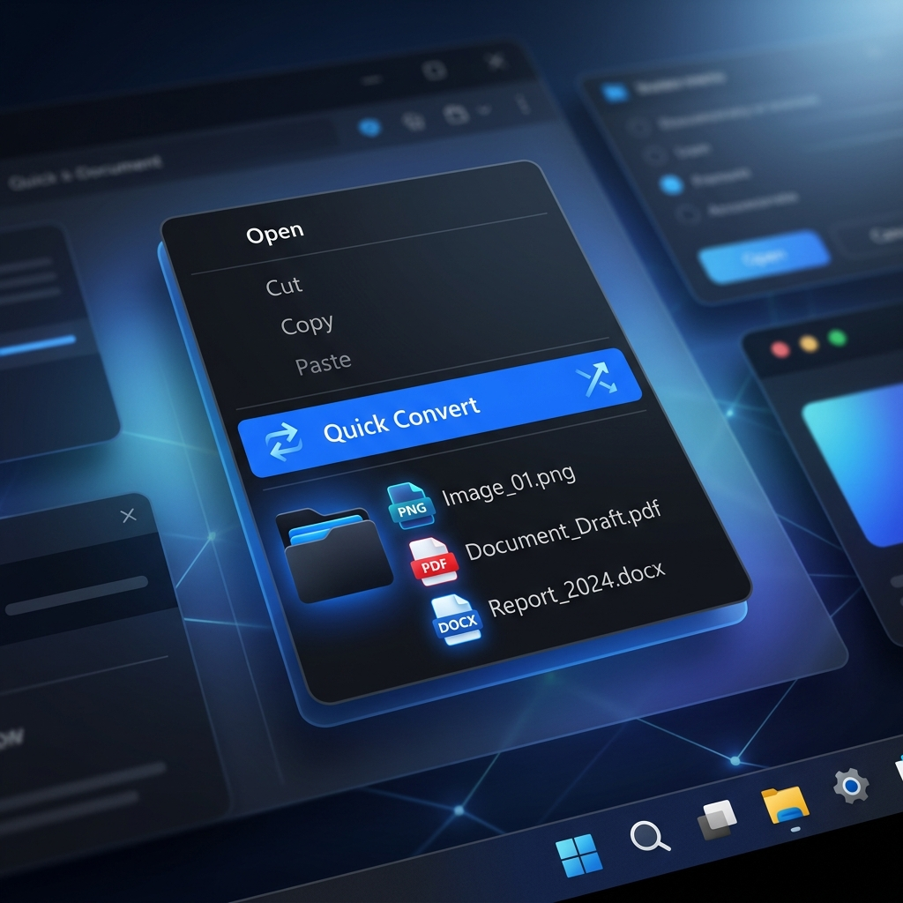

# 🚀 Quick Convert — Windows Shell Extension

**Quick Convert** is a high-performance Windows Shell Extension that lets you convert images, documents, and media files instantly via the right-click context menu. Fully optimized for **Windows 11** with native Modern Context Menu support (no "Show more options" needed).



---

## ✨ Features

### 🖼️ Images
Right-click any image file (`.png`, `.jpg`, `.jpeg`, `.webp`, `.bmp`, `.ico`, `.gif`, `.heic`, `.heif`) to convert it:

| Conversion | Output |
|---|---|
| To PNG | `.png` |
| To JPG | `.jpg` |
| To WebP | `.webp` |
| To BMP | `.bmp` |
| To ICO | `.ico` (256×256, 32-bit) |
| To PDF | `.pdf` (embedded image) |
| Add Watermark | `_watermarked.jpg` |

> **HEIC/HEIF** files are fully supported — converted via FFmpeg automatically.

---

### 📄 PDF
Right-click any `.pdf` file:

| Conversion | Output | Requirement |
|---|---|---|
| To PNG (ZIP) | `.zip` of all pages as PNGs | — |
| To JPG (ZIP) | `.zip` of all pages as JPGs | — |
| Convert to Word | `.docx` | Microsoft Word |

---

### 📂 Office Documents
Right-click any Office file to export it as PDF:

| File Type | Extensions | Requirement |
|---|---|---|
| PowerPoint to PDF | `.pptx`, `.ppt` | Microsoft PowerPoint |
| Word to PDF | `.docx`, `.doc` | Microsoft Word |
| Excel to PDF | `.xlsx`, `.xls` | Microsoft Excel |

---

### 🎬 Video
Right-click any video file (`.mp4`, `.mov`, `.mkv`, `.avi`, `.webm`, `.gif`):

| Conversion | Output | Notes |
|---|---|---|
| To MP4 | `.mp4` | From MOV/GIF/MKV/AVI/WebM |
| To MOV | `.mov` | From MP4/MKV/AVI/WebM |
| To GIF | `.gif` | 10fps, 480px wide, optimized palette |
| To MP3 | `.mp3` | Extracts audio track (libmp3lame, quality 2) |

> "To MOV" is hidden when all selected files are already `.mov`. "To MP4" is hidden for `.mp4` files. Smart context-aware menus!

---

### 🎵 Audio
Right-click any audio file (`.mp3`, `.wav`, `.m4a`, `.flac`, `.aac`, `.ogg`):

| Conversion | Output |
|---|---|
| To MP3 | `.mp3` |
| To OGG | `.ogg` (libvorbis) |
| To WAV | `.wav` |

---

## 🛠️ Installation

1. **Download** — Get the latest release from the [Releases](https://github.com/crane4/QuickConvert/releases) page.
2. **Extract** — Unzip to a permanent location (e.g., `C:\Program Files\QuickConvert`).
3. **Install** — Run `Install.exe` as **Administrator**.
4. **Done** — Right-click any supported file to see the **Quick Convert** menu.

> To uninstall, run `Uninstall.exe` as Administrator. To repair a broken install, run `Repair.exe`.

---

## 📁 Project Structure

```text
QuickConvert/
├── assets/             # Icons, RC resource file, AppxManifest, .def file
├── build/              # Compiled .obj and .res intermediate files
├── dist/               # Build output binaries
├── docs/               # GitHub Pages documentation site
├── include/            # C++ header files (Converter.h, CommandProvider.h)
├── release/            # Final packaged release folder
├── scripts/            # Build and utility scripts
│   ├── build.bat           # Build main app (requires Developer Prompt)
│   ├── build_tools.bat     # Build Install/Uninstall/Repair tools
│   ├── full_build.bat      # Full build (sets up VC env automatically)
│   ├── release.bat         # One-click: build everything + package release ZIP
│   ├── cleanup.ps1         # Deep uninstall + registry cleanup (run as Admin)
│   ├── clean.bat           # Remove build artifacts
│   ├── setup.bat           # Legacy manual setup script
│   └── register.reg        # Manual registry entries (for debugging)
└── src/                # C++ source code
    ├── Converter.cpp       # All conversion logic
    ├── CommandProvider.cpp # Shell extension / context menu provider (DLL)
    ├── QuickConvertExe.cpp # Main GUI application
    ├── dllmain.cpp         # DLL entry point
    ├── test_conversion.cpp # Basic conversion test harness
    └── tools/              # Installer tools source
        ├── Install.cpp
        ├── Uninstall.cpp
        ├── Repair.cpp
        ├── InstallerLogic.cpp / .h
        └── BaseToolGui.cpp / .h
```

---

## 💻 For Developers

### Requirements
- **Visual Studio 2022** with C++ Build Tools and Windows SDK
- **FFmpeg** (`ffmpeg.exe`) in the same folder as `QuickConvert.exe` for media features

### Building

All scripts are in the `scripts/` folder and automatically set the working directory to the project root.

```bat
:: Build the main app + DLL (must be in a Developer Command Prompt)
scripts\build.bat

:: Build Install / Uninstall / Repair tools
scripts\build_tools.bat

:: Full build (auto-detects VS 2022, sets up environment)
scripts\full_build.bat

:: Full release: build everything, assemble release folder, create ZIP
scripts\release.bat
```

> `release.bat` will automatically download `ffmpeg.exe` via `curl` if it is not present.

### Architecture

| Component | File | Role |
|---|---|---|
| Shell Extension DLL | `QuickConvert.dll` | Registers context menu commands via `IExplorerCommand` |
| Main App | `QuickConvert.exe` | Receives file paths + format flag, performs the conversion, shows progress UI |
| Converter Engine | `Converter.cpp` | Pure C++17 conversion logic using WIC, GDI+, WinRT, FFmpeg, and COM automation |
| Installer | `Install.exe` | Registers the Sparse Package + DLL, sets up registry keys |

---

## 📝 Technical Details

- **Core Engine**: C++17 using WIC (Windows Imaging Component), GDI+, WinRT PDF APIs, and COM Automation (for Office conversions).
- **Shell Integration**: Implements `IExplorerCommand` + `IEnumExplorerCommand` for native Windows 11 Modern Context Menu support without the legacy "Show more options" click.
- **Sparse Package**: Uses an `AppxManifest.xml`-based Sparse Package to grant the shell extension a package identity on Windows 11 — required for the Modern Context Menu.
- **Process Isolation**: The DLL is intentionally lightweight. Heavy conversions are delegated to `QuickConvert.exe` to avoid crashing or hanging Explorer.
- **Smart Menus**: Redundant conversion options are automatically hidden (e.g., "To PNG" is hidden when the selected file is already `.png`).
- **Duplicate Guard**: Output filenames are automatically deduplicated — if `file.png` exists, the output becomes `file (1).png`.

---

## 📋 Supported File Types Summary

| Category | Input Formats |
|---|---|
| Images | `.png` `.jpg` `.jpeg` `.webp` `.bmp` `.ico` `.gif` `.heic` `.heif` |
| Video | `.mp4` `.mov` `.mkv` `.avi` `.webm` `.gif` |
| Audio | `.mp3` `.wav` `.m4a` `.flac` `.aac` `.ogg` |
| PDF | `.pdf` |
| Office | `.pptx` `.ppt` `.docx` `.doc` `.xlsx` `.xls` |

---

License: **MIT** | Developed by **crane4**
